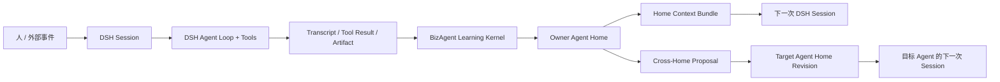

# BizAgent 完整计划

状态：实施基线（Draft 1）
日期：2026-08-29
设计基线：DeepSeek Harness `0.1.1-rc.2`，commit `b150a551b8d465e31e418e1b2eaf5e79bbb7d28e`

实施注记（`0.1.0-alpha.2`）：在不引入通用反思循环的前提下，已提前交付只识别明确纠正的 P0 Lite
Learning Checkpoint、可回读的 Session Evidence，以及 DSH Web UI 插件。本文其余里程碑仍描述更广义的
高价值信号检测与组织级学习目标。

## 1. 一句话定义

BizAgent 是一个安装在 DeepSeek Harness（DSH）上的开源组织学习层：它为长期 Agent 提供可寻址的
Home、多级 Memory、可追溯的自进化机制，以及跨 Agent 的经验流动与组织协作协议。

DSH 负责让 Agent 运行；BizAgent 负责让 Agent 和由 Agent 构成的组织持续变强。

## 2. 为什么值得做

现有 Harness 通常已经能解决模型调用、工具执行、会话历史、权限、沙箱、子 Agent 和任务调度，但“某次
执行成功”不会自然变成“这个 Agent 下次从更高起点开始”，更不会自然变成“组织里的其他 Agent 也获得了
这项能力”。常见的 Memory 产品又大多停在向量检索或聊天历史回忆，没有处理以下问题：

- 经验属于谁；
- 什么可以进入长期上下文；
- 一条观察如何成为洞察、方法或身份的一部分；
- 一个 Agent 是否有权改写另一个 Agent；
- 经验是否真的在后续工作中有效；
- 错误、过时或冲突经验如何修订和退出。

BizAgent 的开源价值不在于再造一个 Agent Loop，而在于把这些组织学习原语做成 DSH 原生、可安装、可审计、
可演进的通用能力。

## 3. 产品目标

### 3.1 核心目标

1. **长期身份**：每个 Agent 有稳定地址、Home、责任边界和版本化身份。
2. **多级记忆**：真实工作可以沉淀为 worklog、memory、insight、knowledge/method 和 identity revision。
3. **单 Agent 自进化**：Agent 能从自己的执行、反馈和结果中形成可复用经验，并在下一次会话中使用。
4. **组织级学习**：经验按 Personal、Business、Role、Capability 的所有权流动，而不是复制到一个公共大脑。
5. **可追溯与可逆**：每次学习都能回到来源证据；每次生效都形成 Revision；错误经验可以修订、降级或退休。
6. **DSH 原生**：以 Cordis 插件和 Bundle 的方式安装，不 fork DSH，不包裹或替换 Agent Loop。

### 3.2 v0.1 不做什么

- 不做另一个聊天应用、HTTP Agent Server 或独立 Runtime。
- 不做通用工作流/DAG 平台。
- 不把 DSH Workspace、AgentPreset 或临时 Subagent 当成长期 Agent 身份。
- 不做“把全部历史塞进向量库”的无治理 Memory。
- 不自动改模型权重，也不让 Agent 无证据地重写自己的核心人格。
- 不实现完整 Project、Work、Inbox、Pulse 或组织管理后台。
- 不要求向量数据库、外部数据库服务或常驻 BizAgent daemon。
- 不在 v0.1 做多租户、远程部署和复杂 RBAC。

## 4. 核心判断

### 4.1 BizAgent 是 DSH Bundle，不是 DSH 上游分叉

发布单元暂定为 `@bizagent/dsh`。用户把它安装进已有 profile：

```sh
dsh plugin --profile web add @bizagent/dsh
dsh --profile web --dump-config
dsh --profile web
```

Bundle 通过 `package.json` 中的 `dsh.bundle` 暴露 `cordis.patch.yml`，在 DSH 插件树中挂载 BizAgent。用户仍可在
profile 或 home 级 patch 中覆盖配置。

### 4.2 BizAgent 不拥有执行平面

| DSH 负责 | BizAgent 负责 |
|---|---|
| Session、Turn、Step、Transcript | Agent Home 与 Home Revision |
| 模型与流式输出 | 多级 Memory 与上下文组合 |
| Tool Registry 与执行策略 | Memory 工具与跨 Home 写入规则 |
| Sandbox、Approval、Credentials | 经验所有权、提案和治理 |
| Goal、Job、Subagent、Agent Team | 长期 Agent 地址与组织目录 |
| Session Persistence、Query | 证据引用、学习回执与适应度 |

BizAgent 只依赖 DSH 的公共 Cordis 服务和事件，不 import 具体 Agent Loop 实现。

### 4.3 Home 不等于 Session、Workspace 或 AgentPreset

- Session 是一次可恢复的执行历史。
- Workspace 是文件工作环境及会话分组。
- AgentPreset 是每个会话的能力和提示词组合。
- Home 是长期 Agent 的身份、经验、知识和学习出口。

一个 Home 可以经历很多 Session；一个 Session 在 v0.1 只绑定一个主 Home；一个 AgentPreset 可以被多个 Home
共享。Home 与 Session 的绑定一旦首次注入上下文，在该 Session 内不可变。

## 5. 系统模型



系统只有一个学习闭环：

```text
真实工作 → 证据 → 候选经验 → 所有权路由 → 验证/治理 → Home Revision
        → 下一次上下文 → 实际使用 → 效果回执 → 修订/强化/退休
```

Work、Project、Frame 和 Inbox 都是产生或传输证据的场所，不是 Memory 本身。

## 6. 不可破坏的设计不变量

1. **一个长期 Agent，一个稳定地址，一个 Home。**
2. **一项长期资产只有一个 owner。** 共享范围也必须有明确 owner，不能由“全体”匿名维护。
3. **跨 Home 不直接写。** 只能提交带证据的 proposal，由目标 Home 的 owner 接受或拒绝。
4. **模型看到的 Home 上下文必须进入 DSH 持久 Session Log。** 不允许在每次请求前静默从磁盘读入而不留痕。
5. **语义文件是长期真相源，运行状态可重建。** Markdown/YAML 保存身份、经验和知识；`storageDomain` 保存索引、
   绑定、队列、Revision、CAS 和回执。
6. **Transcript 是执行证据真相源。** BizAgent 保存引用，不复制一套完整 transcript。
7. **上下文必须有界。** 常驻只注入 Identity 和索引，正文按需读取。
8. **进化必须可解释、可版本化、可回滚。** “变聪明”表现为 Home Revision，不表现为不可见的 prompt 漂移。
9. **消息只传信息，事实由 owner 落盘。** Frame、Inbox 或 Agent Team 的消息都不能替代正式资产和状态。
10. **不修改 DSH Loop。** 所有能力都必须映射到公开插件机制。

## 7. Agent Home

### 7.1 四种长期 Home

协议从第一天支持四类地址：

```text
personal:<id>
business:<id>
role:<id>
capability:<id>
```

| Home | 主要沉淀 |
|---|---|
| Personal | 个人偏好、工作习惯、个人判断与关注方式 |
| Business | 业务事实、指标口径、业务结果与连续经营判断 |
| Role | 专业方法、质量标准、判断框架和专业经验 |
| Capability | 可复用能力、实现约束、操作经验与服务契约 |

v0.1 的实际演示只实现 `Personal + Role`，但存储 schema、地址解析和权限规则不能写死这两类。

### 7.2 Home 基本结构

```ts
interface AgentHome {
  id: string
  address: `${'personal' | 'business' | 'role' | 'capability'}:${string}`
  type: 'personal' | 'business' | 'role' | 'capability'
  displayName: string
  owner?: string
  revision: number
  contextDigest: string
  status: 'active' | 'archived'
}
```

Home 的 `revision` 只在模型可见的 Identity 或有效资产索引发生改变时递增。正文的小改动若改变检索结果，也应
更新 digest 和 revision。

### 7.3 Session 绑定

`HomeResolver` 按以下优先级解析主 Home：

1. 已持久化的 Session Binding；
2. 配置中的 workspace/cwd 映射；
3. profile 配置的 `defaultHome`；
4. 无匹配则不启用 BizAgent 上下文，并给出可诊断状态。

v0.1 实现第 1 至 3 项。首次 Home Context 注入后，当前 Session 的绑定冻结，避免同一 transcript 中身份漂移。

## 8. 多级 Memory 体系

Memory 有两个互相正交的维度。

### 8.1 成熟度维度

| 层级 | 含义 | 典型来源 | 默认治理 |
|---|---|---|---|
| Working Context | 当前 Session 正在使用的信息 | 用户输入、工具结果、Frame | 由 DSH Session 管理，不进 Home |
| Worklog / Episode | 发生了什么、做了什么、结果怎样 | Transcript、Artifact、Receipt | 自动或半自动归档，保留证据 |
| Memory | 一次工作中学到的可复用事实、偏好、坑或规则 | 明确反馈、成功/失败结果 | Home 自有范围可写，必须带来源 |
| Insight | 多次证据支持的模式、因果假设或经验教训 | 多个 Memory/Worklog | 默认候选态，需要核验 |
| Knowledge / Method | owner 认可的标准做法、口径、方法或契约 | Insight、人工规范、外部权威源 | owner 发布，版本化 |
| Identity | Agent 稳定职责、原则、边界和表达方式 | 长期验证过的方法与人工定义 | 高门槛，默认需要人确认 |

这不是强制流水线。一个明确的业务口径可以直接成为 Knowledge；一次用户明确表达的偏好可以直接成为
Personal Memory；Identity 也不能因为某条 Insight 被频繁引用就自动改写。

v0.1 的 Episode 层直接复用 DSH：Session transcript、tool result 和 artifact 是真相源，BizAgent 只维护
`Home → Session` 的有界 Episode Index。`worklogs/` 中的文件是可选的人类可读总结，必须引用原 Session，
不会复制整份 transcript，也不会成为第二套执行事实。

### 8.2 所有权维度

每项资产必须属于一个 Home。`scope` 可以是仅 Home 可见、某个组织可见或公开，但 `ownerAddress` 始终唯一。

```ts
type AssetKind = 'memory' | 'insight' | 'knowledge' | 'method' | 'identity'

interface LearningAsset {
  id: string
  ownerAddress: string
  kind: AssetKind
  title?: string
  description: string
  bodyPath: string
  tags: string[]
  sourceRefs: EvidenceRef[]
  confidence: number
  fitness: number
  status: 'candidate' | 'active' | 'superseded' | 'retired'
  revision: number
  createdAt: string
  updatedAt: string
}
```

### 8.3 EvidenceRef

任何长期学习都要能回答“凭什么”。

```ts
type EvidenceRef =
  | { type: 'session-events'; sessionId: string; fromSeq: number; toSeq: number }
  | { type: 'tool-result'; sessionId: string; eventSeq: number; toolCallId: string }
  | { type: 'artifact'; uri: string; digest: string }
  | { type: 'document'; uri: string; digest: string; authority?: string }
  | { type: 'asset'; ownerAddress: string; assetId: string; revision: number }
  | { type: 'user-confirmation'; sessionId: string; eventSeq: number }
```

正文中可以解释来源，但结构化 `sourceRefs` 才是审计、去重和后续验证使用的依据。

### 8.4 Index-first 上下文

常驻上下文只包含：

- Home 地址、类型和 revision；
- Identity 的有界正文；
- 最近 Episode/Worklog 的一行索引；
- Memory、Insight、Knowledge/Method 的一行索引；
- 如何按需搜索和读取正文的说明；
- 当前 Home 的写入权限和跨 Home 提案规则。

默认预算建议：Identity 6 KiB、资产索引总计 16 KiB、单条 description 最多 240 字符。超过预算时按
`pinned → kind priority → fitness → recency` 确定性裁剪，并在上下文中明确告知省略数量。具体值必须可配置。

v0.1 使用结构化 frontmatter、标签和文本匹配，不引入 embedding 或向量数据库。

## 9. 单 Agent 自进化

### 9.1 “自进化”的准确含义

BizAgent 的自进化不是自动微调模型，也不是不断增长 system prompt。它是 Agent 根据真实工作结果，对自己
拥有的 Home 提出、验证并应用版本化修改；后续 Session 使用新的 Home Revision，并记录这项经验是否有用。

### 9.2 闭环

1. **Observe**：从用户纠正、工具结果、Artifact、失败、验收和显式结论中发现学习信号。
2. **Route**：判断经验属于当前 Personal、Business、Role 还是 Capability Home。
3. **Propose**：形成带 `description + body + sourceRefs` 的候选资产。
4. **Validate**：检查证据可读、与现有资产是否重复或冲突、写入者是否有权。
5. **Promote**：在 owner 允许的层级落盘，产生新的 Home Revision。
6. **Compose**：下一 Session 注入新的有界 Context Bundle。
7. **Use**：Agent 搜索、读取或应用这项经验，产生 Usage Receipt。
8. **Measure**：用户确认、结果改善、冲突或失败形成 Fitness Receipt。
9. **Revise/Retire**：修订、替代、降级或退休低质量资产。

### 9.3 v0.1 的自动化边界

- 通过稳定的 learning policy 提示 Agent 在发现明确可复用经验时主动调用记忆工具；不要求用户每次说“记住”。
- 当前 Home 的普通 Memory 可以由 Agent 直接写，但必须带当前可见 Session 的证据。
- Insight 默认只创建 candidate；Knowledge/Method 需要 owner 接受；Identity 修改默认需要人确认。
- 不在每个 Turn 结束后无条件增加一次反思模型调用。P0 Lite 只对明确纠正触发一次有界 Checkpoint；失败、
  验收等更广义的高价值信号检测仍留给后续版本。
- 自动引用次数不等于正确。Fitness 结合使用、确认、冲突和结果，不以“被模型多次召回”自证有效。

### 9.4 Fitness Receipt

```ts
interface FitnessReceipt {
  id: string
  assetId: string
  ownerAddress: string
  sessionId: string
  eventSeq?: number
  signal: 'retrieved' | 'applied' | 'confirmed' | 'contradicted' | 'failed'
  outcome?: string
  createdAt: string
}
```

v0.1 只记录 receipt 和给出可解释的分数投影，不自动删除资产。退休必须保留 tombstone、替代关系和历史 revision。

## 10. 多 Agent 与组织级协作

### 10.1 组织身份

长期 Agent 通过 canonical address 被发现和引用。DSH 的临时 Subagent/Agent Team 可以承担一次执行，但不会
自动获得新的长期 Home。只有被组织目录登记的地址才是长期主体。

### 10.2 跨 Home 学习协议

```ts
interface MemoryProposal {
  id: string
  fromAddress: string
  toAddress: string
  proposedKind: 'memory' | 'insight' | 'knowledge' | 'method' | 'identity'
  description: string
  body: string
  sourceRefs: EvidenceRef[]
  status: 'pending' | 'accepted' | 'rejected' | 'withdrawn'
  targetAssetId?: string
  decision?: string
  createdAt: string
  decidedAt?: string
}
```

规则：

- 发送方只能创建 proposal，不能直接修改目标 Home。
- 目标 owner 查重、核验和编辑最终内容后接受或拒绝。
- 接受操作幂等；生成的资产 frontmatter 写入 `proposalId`。
- 目标资产落盘后才递增目标 Home Revision。
- proposal 的发送、审核和结果都可审计，但普通消息不会改变 proposal 状态。

### 10.3 三种协作方式

| 方式 | 语义 | 是否独立 Session | 是否产生长期状态 |
|---|---|---:|---:|
| Frame | 当前 Session 只读挂载其他 Home 的 Identity 和索引 | 否 | 默认不产生 |
| Inbox | 让另一个长期 Agent 在隔离 Session 独立判断并回复 | 是 | 消息本身不是长期知识 |
| Work / Project | 明确 owner、完成判据、产物和终态责任 | 视实现而定 | 责任账本有状态 |

v0.1 先完成“独立 Session + 跨 Home proposal”的组织学习闭环。v0.2 增加只读 Frame，v0.3 再增加 Inbox；
Work/Project 位于后续集成层，不进入 Learning Kernel。

## 11. DSH 集成设计

### 11.1 使用的公开扩展点

| BizAgent 能力 | DSH 机制 |
|---|---|
| 安装与组合 | Bundle + `cordis.patch.yml` |
| 稳定学习规则 | `ctx.systemPrompt.section()` |
| Home Context 注入 | `agent/pre-step` / `agent.inject()`，形成持久 `user/message` |
| Memory 操作 | `ctx.tools.register()` |
| 权限和路径不变量 | 工具服务内校验；必要时 `ctx.tools.guard()` |
| 执行证据观察 | `tools/result` 与 `session/event` |
| transcript 检索/证据验证 | `ctx.sessionQuery` |
| 非 Session 持久状态 | `ctx.storageDomain` |
| Session/Home 绑定 | `storageDomain` + Agent/Session 生命周期事件 |

动态 Home Context 不直接作为每次请求重新计算的 system section。实现应仿照 DSH `agent-instructions`：首次注入
和 revision 变化都追加带类型 source 的持久 user message；压缩后按当前 revision 恢复。这样 replay 能精确知道
模型当时看到了哪个 Home 版本。

### 11.2 建议的内部组件

初期仍发布为一个包，但内部明确分层：

```text
@bizagent/dsh
├── HomeRegistry          # 地址、Home、目录、SessionBinding
├── HomeStore             # 文件布局、原子写、frontmatter、索引重建
├── HomeContextComposer   # 有界、确定性的 Context Bundle
├── LearningPolicy        # 层级、所有权、晋升与权限规则
├── MemoryTools           # remember/search/read/update/retire/feedback
├── ProposalLedger        # propose/list/accept/reject + CAS
├── EvidenceResolver      # DSH SessionQuery、Artifact digest
├── LearningObserver      # tools/result、session/event、usage receipt
└── CompatibilityGate     # DSH 能力与版本检查
```

只有在公共 API 稳定或出现独立复用需求后再拆 npm 包，避免 v0.1 过早形成包图。

### 11.3 Context Bundle 协议

```ts
interface HomeContextBundle {
  homeAddress: string
  revision: number
  digest: string
  identity: string
  episodeIndex: ContextIndexRow[]
  memoryIndex: ContextIndexRow[]
  insightIndex: ContextIndexRow[]
  knowledgeIndex: ContextIndexRow[]
  methodIndex: ContextIndexRow[]
  omitted: Record<string, number>
}
```

同一个 `revision + digest` 在同一 context epoch 中不重复注入。revision 变化时追加明确的 replacement；DSH
compaction 遮蔽旧上下文后重新注入完整当前 Bundle。

### 11.4 DSH 兼容策略

- 第一条实现分支固定 DSH `0.1.1-rc.2` 和上述 commit 作为开发基线。
- `peerDependencies` 只声明实际使用的公共包，版本范围在兼容测试通过后确定。
- 启动时检查 `tools`、`systemPrompt`、`storageDomain`、`sessionQuery` 和 Session Persistence 等必需能力；缺失时
  fail-fast，错误中列出版本和缺失 seam。
- 所有 DSH import 收敛到 `src/dsh/` 适配层；领域模型不携带 DSH 类型。
- CI 至少跑“当前锁定版本”，稳定后增加“下一候选版本”非阻塞兼容任务。

## 12. 文件与状态布局

默认目录：

```text
$DSH_HOME/bizagent/
├── config.yaml
├── directory.yaml
└── homes/
    └── <safe-home-id>/
        ├── home.yaml
        ├── identity.md
        ├── memory/
        │   └── <asset-id>.md
        ├── insights/
        │   └── <asset-id>.md
        ├── knowledge/
        │   └── <asset-id>.md
        ├── methods/
        │   └── <asset-id>.md
        ├── worklogs/
        │   └── <session-id>.md
        └── archive/
```

目录名使用安全的内部 `home.id`，canonical address 保存在 `home.yaml`，避免地址字符和跨平台路径问题。

### 12.1 文件保存什么

- Home 元数据和身份；
- Memory、Insight、Knowledge、Method 正文及 frontmatter；
- 可阅读的 worklog/episode；
- 退休或被替代资产的历史版本。

### 12.2 `storageDomain` 保存什么

- Home registry 和 Session bindings；
- Home revision/digest；
- proposal 状态机与幂等键；
- 可重建的资产索引和文件 digest；
- context epoch/注入记录；
- Fitness/Usage receipts；
- reconciliation 和 migration 状态。

`storageDomain` 没有跨表事务、二级索引和跨进程变更广播，因此 v0.1 采用单进程写入、单记录 CAS、稳定幂等键
和启动对账，不假设不存在的事务能力。

### 12.3 文件与 ledger 的一致性

关键写入使用以下顺序：

1. 校验 owner、证据、基线 revision 和幂等键；
2. 在同目录写临时文件并原子 rename；
3. 更新索引和 Home revision；
4. 结算 proposal/receipt；
5. 发布进程内变更事件。

接受 proposal 时，新资产 frontmatter 带 `proposalId`。若步骤 2 后进程崩溃，启动对账可发现资产并完成 ledger；
若 ledger 声称 accepted 但文件缺失，则标记 degraded，绝不静默生成另一份内容。

## 13. v0.1 工具面

工具名暂时统一加 `bizagent_` 前缀，避免与其他 Bundle 冲突。

| 工具 | 能力 | 权限 |
|---|---|---|
| `bizagent_home_status` | 查看当前绑定、revision、预算和待处理 proposal 数 | 当前 Session |
| `bizagent_memory_search` | 搜索 Episode、Memory、Insight、Knowledge/Method 索引 | read |
| `bizagent_memory_read` | 按 id 读取资产正文或有界 Episode 摘要，并记录 retrieved receipt | read |
| `bizagent_memory_remember` | 给当前 Home 写 Memory | own-home write |
| `bizagent_memory_update` | 修订或退休当前 Home 的资产 | own-home policy |
| `bizagent_memory_propose` | 向其他 Home 提交带证据的候选 | cross-home propose |
| `bizagent_proposals` | 列出或读取发出/收到的 proposal | sender/target |
| `bizagent_proposal_accept` | 编辑最终内容并发布到目标 Home | target owner |
| `bizagent_proposal_reject` | 驳回并记录理由 | target owner |
| `bizagent_memory_feedback` | 记录确认、冲突、失败或结果 | current session |

模型不能通过这些工具创建长期 Home、改变 owner 或直接改 Identity。管理操作由 companion CLI 或人工编辑配置完成。

公开 alpha 前提供一个不常驻的管理 CLI：

```text
bizagent init
bizagent home create <address>
bizagent home list
bizagent doctor
bizagent reindex
```

CLI 只做文件初始化、诊断、迁移和索引修复，不运行 Agent、不另起服务。

## 14. 权限与治理

### 14.1 默认规则

| 操作 | 默认规则 |
|---|---|
| 读取当前 Home | 允许 |
| 写当前 Home Memory | 允许，但必须带有效证据 |
| 写当前 Home Insight | 只创建 candidate |
| 发布 Knowledge/Method | owner 接受或配置允许 |
| 改 Identity | 人确认 |
| 读其他 Home | 只有显式 Frame/授权范围允许 |
| 写其他 Home | 永远拒绝，只能 proposal |
| 接受 proposal | 目标 owner |

v0.1 是单用户、本地运行：owner 校验的可执行含义是“当前 Session 的不可变主 Home 与目标 Home 相同”；
本机管理 CLI 视为人工管理员入口。多用户 principal、委托和组织 RBAC 留到远程控制面阶段，不能在 v0.1 用
Home 名称冒充完整身份认证。

### 14.2 v0.1 威胁模型

Home root 应放在普通 Session workspace 之外，模型通过 BizAgent 工具访问。BizAgent 的路径解析必须 canonicalize、
拒绝 `..`、拒绝越出 Home root，并审慎处理 symlink。

DSH 的 `write/edit` 可以按目标路径守卫，但任意 Bash 的完整语义无法可靠解析。v0.1 明确采用“BizAgent API 硬边界 +
DSH sandbox + 模型协作约束”的软文件边界；如果用户把 `$DSH_HOME/bizagent` 放进可写 workspace，BizAgent 不声称能
阻止 Bash 绕过。`bizagent doctor` 必须检测并警告危险重叠。更强隔离应通过独立存储进程或 OS 权限实现，而不是
启发式解析 shell。

## 15. 最小纵向切片

v0.1 不是“先做一堆基础类”，而是完成下面两条可演示链路。

### 15.1 链路 A：单 Agent 自进化

参与者：`personal:alice`

1. Alice 在 Session A 中完成一个真实任务，并纠正 Agent 的一个长期偏好或做法。
2. Agent 识别可复用信号，调用 `bizagent_memory_remember`，引用这次纠正的 Session event。
3. BizAgent 校验证据、写入 Personal Memory、生成 Home Revision 2。
4. 重启 DSH。
5. Session B 再次绑定 `personal:alice`，持久注入 Revision 2 的 Identity 和 Memory 索引。
6. Agent 搜索/读取该 Memory，并在相似任务中主动应用。
7. 用户确认或结果证据形成 Fitness Receipt。

证明：记忆跨 Session、跨进程存活；不是聊天历史摘要；模型知道自己使用了哪条经验。

### 15.2 链路 B：组织级学习

参与者：`personal:alice`、`role:growth-strategy`

1. Alice 在个人会话中从一次增长分析得到可复用的专业方法。
2. Personal Agent 判断该经验属于 Role，而非自己的长期偏好。
3. 它调用 `bizagent_memory_propose`，把带证据的观察投给 `role:growth-strategy`。
4. Personal Agent 尝试直接写 Role Home 时被拒绝。
5. Role 的独立 Session 列出 proposal，查阅来源，编辑后接受。
6. Role Home 产生新资产和新 Revision。
7. 新的 Role Session 自动得到新索引，按需读取并在另一项任务中应用。

证明：经验能跨 Agent 流动，但所有权、审核、版本和证据没有丢失。

## 16. v0.1 验收标准

以下条件全部成立才称为 v0.1：

1. 能以 Bundle 安装到现有 DSH profile，无需 fork 或修改 DSH 源码。
2. 插件卸载后 DSH 基础运行能力不受影响，Home 数据默认保留。
3. Session 能确定性绑定 Home，首次注入后不可换绑。
4. Home Context 以持久消息进入 Session Log，replay 能还原当时 revision/digest。
5. 只注入有界 Identity 和索引；正文只在工具读取后进入 transcript。
6. 当前 Home Memory 能跨 Session 和 DSH 重启保留。
7. 每项通过学习流程新增的 active 资产至少有一个可解析 EvidenceRef；无效或不可见来源被拒绝。
8. 通过 BizAgent tool/service API 的跨 Home 直接写入为零；proposal 接受/拒绝幂等且可审计。
9. proposal 接受后目标 Home Revision 递增，下一 Session 看到新索引。
10. Memory 的 retrieved/applied/confirmed/contradicted/failed 至少能形成 receipt。
11. 文件损坏、索引丢失或中途崩溃能由 `doctor/reindex` 检测并尽量修复，不静默造新事实。
12. 单元、集成、重启恢复和两条纵向 E2E 全部通过。

## 17. 实施路线

工期只作为单人全职开发的参考；每个阶段以退出条件为准，不以日历为准。

### M0：DSH 兼容性 Spike（2–3 天）

交付：

- 最小 TypeScript/npm 包；
- `dsh.bundle` manifest 和 `cordis.patch.yml`；
- 一个可加载/卸载的 Cordis 插件；
- 对 `ctx.tools`、`ctx.systemPrompt`、`ctx.storageDomain`、`ctx.sessionQuery` 的编译与运行时探测；
- DSH 固定版本的测试 profile 和 `--dump-config` 快照；
- ADR：Bundle 边界、Home 与 AgentPreset 的区别、模型可见内容必须落 Session Log。

退出条件：插件可通过 checkout 和 packed tarball 安装；启动、热卸载和重启无错误；确认所有 v0.1 必需 seam 可用。

### M1：Home Kernel（4–5 天）

交付：

- canonical address 和 Home schema；
- 文件目录、原子写入、frontmatter parser；
- HomeRegistry、HomeResolver、SessionBinding；
- 基于 SessionBinding 的 Episode Index，不复制 DSH transcript；
- revision/digest 和可重建索引；
- `bizagent init/home/doctor/reindex` 最小 CLI；
- Personal、Role 示例 Home。

退出条件：两个 Session 可分别稳定绑定两个 Home；重启后绑定和 revision 一致；危险路径配置会 fail-fast 或告警。

### M2：Memory 与 Context Bundle（5–7 天）

交付：

- Episode/Worklog index 与 Memory asset schema、状态；
- ContextComposer、预算和确定性裁剪；
- 持久 context 注入及 compaction 后恢复；
- `home_status/search/read/remember/update` 工具；
- DSH SessionQuery EvidenceResolver；
- tool/result 与 usage receipt 观察。

退出条件：完成链路 A；相同 revision 不重复注入；正文不提前进入 prompt；无证据写入被拒绝。

### M3：Proposal 与组织学习（5–7 天）

交付：

- ProposalLedger 和状态机；
- `propose/proposals/accept/reject` 工具；
- owner 权限和跨 Home hard deny；
- proposal 接受的文件/ledger 对账；
- Role Home Revision 和独立 Session 演示。

退出条件：完成链路 B；重复提交/重复接受不产生重复资产；崩溃窗口可对账；直接跨 Home 写入测试全部失败。

### M4：Fitness 与自我修订（4–5 天）

交付：

- FitnessReceipt；
- confirmed/contradicted/failed 反馈；
- revision、supersede、retire 和 tombstone；
- 冲突检测与重复候选提示；
- 初版 learning quality 报告。

退出条件：错误 Memory 可被替代或退休；新 Session 不再看到退休项；审计仍能追溯旧 revision。

### M5：v0.1 Alpha 发布（4–5 天）

交付：

- 安装、快速上手、概念、工具、数据格式、恢复和安全文档；
- 两条可复现 demo；
- MIT License、贡献指南、行为准则、Issue/PR 模板；
- typecheck、lint、unit、integration、E2E、pack/install CI；
- npm tarball 和 DSH compatibility matrix；
- 数据 schema version 与 migration 框架。

退出条件：在干净机器/容器中按 README 从安装到完成两条 demo；没有依赖 GrowthOS 私有代码或数据。

### M6：v0.2 组织上下文（后续）

- Business、Capability Home 的完整 E2E；
- Organization Directory 和授权可见性；
- `Frame open/search/read/close`，同一 Session 只读联合多个 Home；
- 将 P0 Lite 的明确纠正检测扩展为失败、验收等可插拔高价值信号；
- Insight 的多证据生成、核验和晋升；
- 可选 DSH Web Client 只读界面。

### M7：v0.3 组织协作（后续）

- Inbox 的异步投递、线程、return-to 和独立 Session；
- proposal 通知与 owner 唤醒；
- DSH Agent Team 作为可选临时执行后端；
- Work/Project 适配接口，但不把责任账本塞进 Memory Kernel；
- 组织学习图谱、经验流向和人介入率。

## 18. 建议仓库结构

```text
bizagent/
├── package.json
├── pnpm-lock.yaml
├── tsconfig.json
├── vitest.config.ts
├── cordis.patch.yml
├── src/
│   ├── index.ts
│   ├── config.ts
│   ├── domain/
│   │   ├── address.ts
│   │   ├── home.ts
│   │   ├── asset.ts
│   │   ├── evidence.ts
│   │   ├── proposal.ts
│   │   └── receipt.ts
│   ├── store/
│   │   ├── home-store.ts
│   │   ├── index-store.ts
│   │   └── reconciliation.ts
│   ├── context/
│   │   ├── composer.ts
│   │   └── injector.ts
│   ├── learning/
│   │   ├── policy.ts
│   │   ├── fitness.ts
│   │   └── observer.ts
│   ├── proposals/
│   │   └── ledger.ts
│   ├── tools/
│   ├── dsh/
│   │   ├── services.ts
│   │   ├── events.ts
│   │   └── compatibility.ts
│   └── cli/
├── tests/
│   ├── unit/
│   ├── integration/
│   ├── recovery/
│   └── e2e/
├── examples/
│   └── learning-loop/
└── docs/
```

初期只建一个 package，不拆 monorepo。当前 Web UI 作为同一 DSH bundle 的独立 `ui-host` 插件交付，保持领域核心
与 Web transport 解耦。

## 19. 测试与评估

### 19.1 自动化测试层

| 层 | 重点 |
|---|---|
| Unit | 地址、schema、权限、排序、预算、digest、状态机、fitness 投影 |
| Store contract | 原子写、重建、损坏文件、symlink/path traversal、schema migration |
| Cordis integration | 服务注入、工具注册、effect 卸载、事件顺序、scope 隔离 |
| Session integration | 首次注入、revision replacement、compaction、resume/replay |
| Recovery | 文件写后崩溃、ledger 写后崩溃、索引丢失、重复 accept、DSH 重启 |
| E2E | 单 Agent 自进化、跨 Home proposal、卸载保留数据、packed install |

核心领域测试不得依赖模型和网络。模型 E2E 是单独、可选的评估套件。

### 19.2 学习质量指标

| 指标 | 含义 |
|---|---|
| Evidence coverage | 有合法来源的 active 资产比例，目标 100% |
| Useful recall rate | 被读取后得到 confirmed/applied 的比例 |
| Contradiction rate | 使用后被 contradicted/failed 的比例 |
| Proposal acceptance | 跨 Home proposal 被接受、编辑、拒绝的分布 |
| Context overhead | Home Context 的字节/token 占用及省略量 |
| Time-to-benefit | 从经验产生到在新 Session 首次有效使用的时间 |
| Cross-home violations | 通过 BizAgent API 未经 proposal 的目标 Home 写入，目标为 0 |
| Stale asset rate | 长期未验证、被新证据冲突或 owner 缺失的资产比例 |

不能用“Memory 数量”或“召回次数”作为成功指标；它们很容易奖励污染和自我强化。

### 19.3 对照评估

为每个 demo 准备固定任务集，比较：

1. 无 Home；
2. 旧 Home Revision；
3. 新 Home Revision；
4. 新 Revision 但屏蔽目标资产。

只有新 Revision 在正确场景稳定改善结果、同时不显著伤害无关任务，才能说明发生了有效学习。

## 20. 可观测性与诊断

v0.1 至少输出：

- 当前 DSH/BizAgent 版本与兼容状态；
- Session → Home 绑定；
- 注入的 revision、digest、字节数和省略数；
- Memory 搜索、读取、写入、修订、退休；
- proposal 创建、接受、拒绝及目标资产；
- reconciliation、损坏文件和降级状态；
- receipt 与 fitness 投影。

日志不能复制完整 Memory 正文、用户原话或凭证。诊断信息使用 id、digest 和结构化原因。

## 21. 开源与发布

### 21.1 发布原则

- 许可证使用 MIT，与 DSH 保持一致。
- 不复制 DSH 内部源码；通过公开 npm 包和 Cordis seam 集成。
- 每个 BizAgent release 公布 DSH compatibility matrix。
- 使用 SemVer；Home 数据 schema 单独版本化，升级前备份，迁移必须可 dry-run。
- npm 发布预构建产物，避免要求普通用户批准 git dependency 的安装期构建。
- Alpha 同时保证 CLI/headless、Web profile 和独立 `ui-host` 插件可挂载。

### 21.2 文档集

公开 alpha 必须具备：

- `README`：定位、30 分钟快速上手和 demo；
- Concepts：Home、Memory levels、ownership、revision、evidence、fitness；
- DSH integration：Bundle、profile、配置和兼容性；
- Operations：备份、恢复、doctor、reindex、升级和卸载；
- Security：软文件边界、sandbox 要求和已知限制；
- Contributor guide：架构边界、测试方式和 ADR 流程。

首个实现阶段可以中文为主；公开 beta 前补齐英文主文档。

## 22. 主要风险与应对

| 风险 | 应对 |
|---|---|
| DSH developer preview 接口变化 | 固定版本、适配层、启动 gate、兼容 CI |
| Memory 污染或自我强化 | 强制证据、候选态、owner 治理、contradiction/retire、对照评估 |
| 上下文无限增长 | index-first、字节预算、确定性裁剪、正文按需读 |
| Agent 身份与 Preset/Session 混淆 | 独立 HomeRegistry 和不可变 SessionBinding |
| 跨 Home 越权 | 服务层 hard deny、proposal、sandbox、doctor 重叠检查 |
| 文件与 ledger 双写崩溃 | 原子文件写、幂等键、proposalId、启动 reconciliation |
| storageDomain 无跨进程通知/事务 | v0.1 单进程写者、CAS、禁止多主；后续再设计远程控制面 |
| 过早做组织编排 | 先完成两条学习闭环；Frame/Inbox/Work/Project 分阶段加入 |
| 过早引入向量数据库 | v0.1 用小规模可解释检索；以评估证明需要后再增加 provider |
| 只看“记住了”不看“有用” | Usage/Fitness receipt 和 before/after 对照测试 |

## 23. 暂缓但不遗忘的决策

以下问题不阻塞 v0.1，但必须在对应里程碑前通过 ADR 决定：

1. `@bizagent` npm scope 是否可用；不可用时采用哪个无 scope 包名。
2. DSH 公共包的最终 peer dependency 范围。
3. v0.2 Frame 是否需要自定义 durable event，还是只依赖工具结果和 ContextRef。
4. Identity revision 的人类确认如何接 DSH Approval。
5. 多组织/多用户时，owner、principal 和 credential 如何映射。
6. 何时引入全文索引或 embedding provider，以及离线/隐私默认值。
7. Home 的 Git snapshot/backup 是否进入核心包或保持外部运维能力。

## 24. 立即施工顺序

下一步不从 UI 或完整数据模型开始，而按以下顺序推进：

1. 完成 M0 compatibility spike，证明 Bundle 能在本地 DSH 基线上安装和访问必需 seam。
2. 写三份 ADR：DSH-native Bundle、Agent Home 身份边界、file-first + durable context injection。
3. 实现 `AgentHome / SessionBinding / HomeRevision` 三个最小对象。
4. 先做静态 Identity + 空索引的 Context Bundle，验证持久注入、resume 和 compaction。
5. 实现当前 Home 的 `remember/search/read`，跑通链路 A。
6. 再实现 proposal 和 Role owner，跑通链路 B。
7. 补 fitness、retire、doctor/reindex 和故障恢复。
8. 最后整理安装体验、示例、CI 和 npm alpha 发布。

任何新增功能如果不能直接帮助链路 A 或链路 B 通过 v0.1 验收，应进入 v0.2 backlog。
